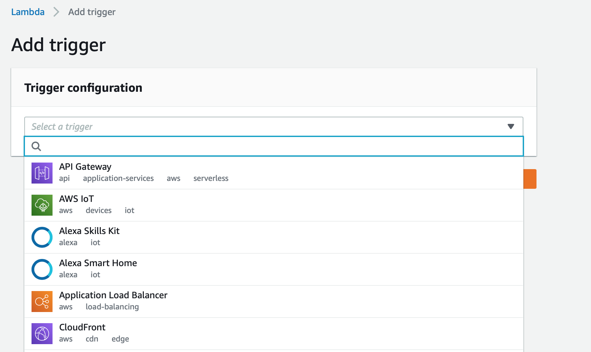

# how to deploy nodejs express to Aws lamdba

#####preconditions  
- install claudia.js    
- install nodejs express
- import npm
- make a AWS Account, if you dont already have one
- save all dependency's locally such as request and etc.

 
### steps when project is done
- install claudia.js serverless express with this commando in terminal `npm install claudia -g`
- type in claudia --version
- to setup the project for deployment in Aws lambda run this command in terminal `Claudia generate-serverless-express-proxy --express-module YourMainModuleNameHere `
 and replace YourMainModuleNameHere < with your Main module name
- When that is done, compress the project folder into a zip file
- if you are using app.listen(port) in your code then replace it with  module.exports = app; ´https://claudiajs.com/tutorials/serverless-express.html'
- Things should run smoothly by then.

### How to deploy the zip file.
- in the amazon lambda section, create a new function and upload your zip file afterwards

- press on the save button to save the project.
- when you have uploaded the zip file then change the handler, which is in the function code, you can access function code
 by pressing on the function name and then scroll down.
- change the handler From index.handler to lambda.handler

### Creating a gateway for the function

- To make a API gateway which also acts as a trigger-point
- press on Add Trigger and you should get to this pege where you are going to pick a 
  trigger

- pick the API Gateway and select "Create a new API" and fill the missing infomation on the pege

- press the add to finish the setup of the API GateWay
- press on the API gateway and scroll down to the buttom of the pege,
 where you should be able to se the link to the aws endpoint

### adding and removing API methods(GET,PUT,POST ETC)
- select services in the top section of the site, and then press services, and search for API Gateway, here you are able to find your created API's and manage dem,
- To add an method to an API, press one of the created API's

- press on the create method a empthy select bar should pop up 

- selet a method and press the conform button

- your page should now look like this.

- Enable  **Use Lambda Proxy integration**
- Select Lambda region of your choosing
- Lambda Function: write your function name.
- press save to complete the action

### How to see the function code
- press on the designer tab, 
- press on the function name, which has a orange logo
 and scroll down where you will be able to see the files and
edit the function code. 

